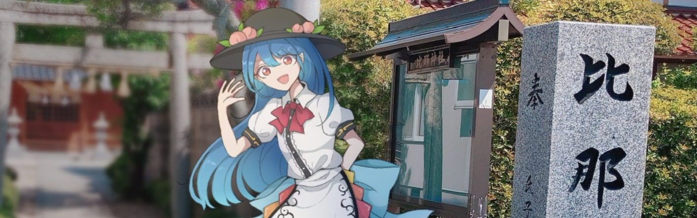

# 👋 Hallo, I'm Horstaufmental!

  <picture>
    
  </picture>

[Source: hiratose02 (mxx 459)](https://x.com/Mxx_459/status/1522906505611456514)

> *Existence is collective: what the many believe, the world substantiates. Proof that consciousness itself can sculpt reality.*

Computer Science Major and Nuclear Energy Enthusiast

## About Me

- I love diving deep into the wonders of nuclear energy and unraveling intriguing topics about computers (mostly in a software sense).
- Mostly what I have here is just tinkering and experimenting with code and stuffs, rather than focusing on big (useful) projects.
- Some Languages I Use:
  - ~~Fluent~~ in **LuaU**
  - Currently learning **C**, **Rust**, and **Web Development**
- Currently Developing for:
  - [Realistic Boiling Water Reactor](https://www.roblox.com/communities/16332057)\'s Brzegowa Hydroelectric
  - FranzEulenberg's [Democratic People's Republic of Korea](https://www.roblox.com/communities/905672052)

## Current Projects

  <picture>
    
  </picture>

*Built in 2011 by the Moriya Shrine Foundation with the collaboration of the Chireiden, it is stationed underground below the Former Hell and Palace of Earth Spirits, the power plant has been the main source of electricity for the whole of Gensokyo ever since its first operations.*

A Roblox experience about nuclear power plant simulation, intended to simulate the operations of a CANDU reactor with an arcade-realistic style in an environment set in the Touhou Project universe.

More information can be found [here.](https://horstaufmental.cc/ynpp)

  <picture>
    
  </picture>

A recreation of the GNU Coreutils as part of my learning journey to the C Programming Language.

  <picture>
    
  </picture>

A subset of the **coreutils from scratch** project, written in Rust as my learning journey to the language.
